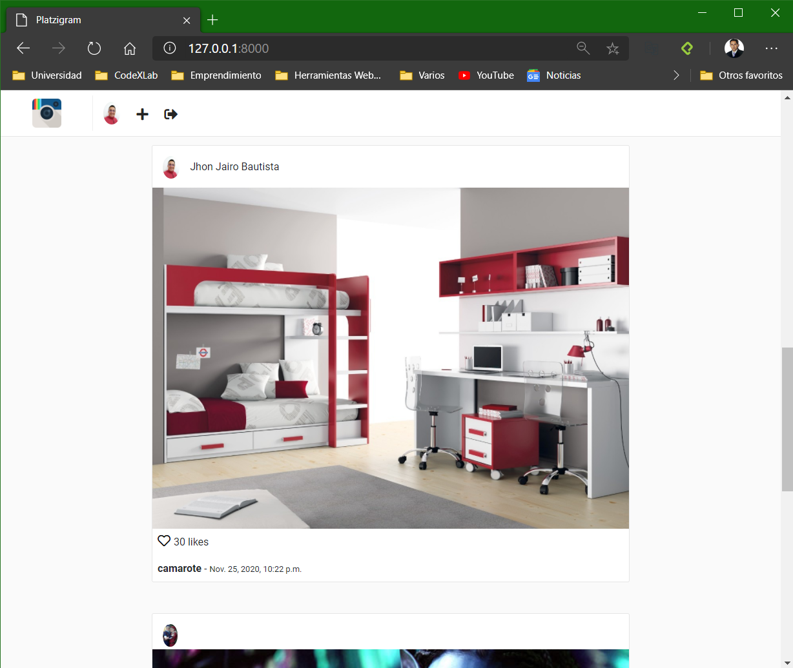

# Platzigram

Django is a very popular framework and used in large companies, such as: Instagram, Sentry, National Geographic.

This application was based on this technology in order to practice what was learned in the course

## Application

## Author
  
 ### Jhon Jairo Bautista
   
